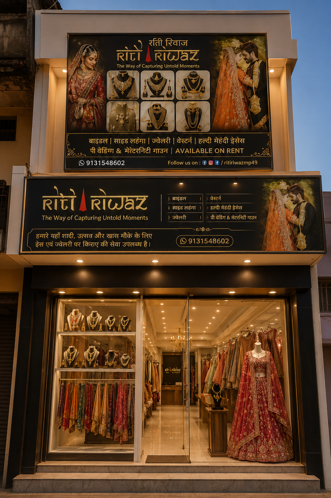
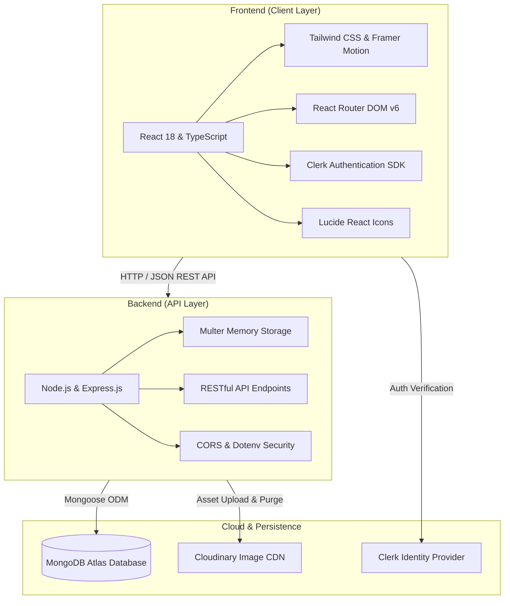

# 👑 Riti Riwaz — Premium Bridal Couture & Occasion Wear Rental Platform

<div align="center">

[](https://react.dev/)
[](https://www.typescriptlang.org/)
[](https://tailwindcss.com/)
[](https://nodejs.org/)
[](https://expressjs.com/)
[](https://www.mongodb.com/atlas)
[](https://cloudinary.com/)
[](https://clerk.com/)
[](https://vitejs.dev/)

<br />

**"The Way of Capturing Untold Moments"**

*A modern full-stack web application developed for **Riti Riwaz**, a premier luxury bridal couture and designer occasion wear rental boutique based in Narsinghpur, Madhya Pradesh.*

---

### 🌐 [**🔗 View Live Demo**](https://riti-riwaz.vercel.app) *(Replace with your live production URL)* &nbsp;|&nbsp; 💬 [**WhatsApp Inquiry Flow**](https://wa.me/919131548602) &nbsp;|&nbsp; 🔐 [**Admin Portal**](/admin)

---

</div>

<br />

## 📖 Table of Contents

- [🌟 Executive Summary & Client Impact](#-executive-summary--client-impact)
- [✨ Key Features](#-key-features)
  - [🛍️ Customer Experience & Boutique Storefront](#️-customer-experience--boutique-storefront)
  - [🛡️ Secure Admin Portal & Business Suite](#️-secure-admin-portal--business-suite)
  - [⚡ Performance, Architecture & Reliability](#-performance-architecture--reliability)
- [🖼️ Visual Showcase & Screenshots](#️-visual-showcase--screenshots)
- [🛠️ Technology Stack](#️-technology-stack)
- [🏗️ System Architecture & Data Flow](#️-system-architecture--data-flow)
- [🚀 Getting Started (Local Development)](#-getting-started-local-development)
  - [Prerequisites](#prerequisites)
  - [Environment Configuration](#environment-configuration)
  - [Installation & Running](#installation--running)
- [📦 API Reference](#-api-reference)
- [🌐 Deployment Guide](#-deployment-guide)
- [👨‍💻 Author & Freelance Portfolio](#-author--freelance-portfolio)

---

## 🌟 Executive Summary & Client Impact

### 🏢 The Client
**Riti Riwaz** is a luxury ethnic wear boutique located in Narsinghpur, MP, catering to high-end bridal lehengas, pre-wedding gowns, haldi & mehndi outfits, maternity shoot ensembles, and imperial jewellery for purchase and rental.

### 🎯 The Business Challenge
- Transition from traditional walk-in only business to an **omnichannel digital boutique**.
- Eliminate friction in **rental date booking & sizing consultations**.
- Enable non-technical boutique staff to easily **manage inventory, upload high-definition images, track rental availability, and monitor customer leads** in real time without paying expensive SaaS subscriptions.

### 💡 The Delivered Solution
I engineered an end-to-end, high-performance web platform featuring:
1. **Bespoke Luxury UI/UX** tailored for ethnic haute couture (Royal Charcoal & Gold aesthetics, glassmorphism, fluid micro-interactions).
2. **"Find Your Look" Interactive Outfit Curator** matching customers to the right garments in seconds.
3. **Automated WhatsApp Lead Generation Engine** constructing structured booking details with one click.
4. **Full-Featured Admin Management Portal** powered by Clerk Auth, MongoDB Atlas, and Cloudinary auto-cleanup lifecycle.
5. **Zero-Downtime Hybrid Backend** with seamless offline/mock data fallback to guarantee 100% storefront uptime.

---

## ✨ Key Features

### 🛍️ Customer Experience & Boutique Storefront

* **👑 Royal Aesthetic & Responsive Luxury UI**: Hand-crafted design system with warm gold gradients (`#D4AF37`), dark charcoal surfaces, smooth typography (`Playfair Display`, `Cormorant Garamond`, `Plus Jakarta Sans`), and fluid Framer Motion animations.
* **👗 Multi-Category Catalogue & Filter Matrix**:
  * Real-time filtering by category (*Bridal Lehengas, Side Lehengas, Pre-Wedding Gowns, Haldi/Mehndi, Maternity, Western Fusion, Imperial Jewellery*).
  * Filter by occasion (*Wedding, Sangeet, Reception, Cocktail, Haldi, Baby Shower*).
  * Filter by rental status (*Rental Ready, Available, Currently Rented*).
* **🔮 "Find Your Look" Interactive Outfit Matcher**: A 3-step interactive questionnaire guiding brides and guests to their ideal attire based on event type, style preference, and role.
* **🔍 Instant Global Search**: Modal search bar with instant keyboard shortcuts (`Cmd+K` / `Ctrl+K`), keyword matching, and live tag filtering.
* **🔎 High-Definition Lightbox & Image Zoom**: Multi-angle zoomable view allowing customers to inspect delicate zardozi, tilla embroidery, dabka, and fabric craftsmanship.
* **💬 1-Click WhatsApp Rental Inquiry Engine**:
  * Calculates dates, customer measurements, and specific outfit codes (`RR-BD-01`).
  * Auto-generates structured WhatsApp messages directly routing into the store owner's WhatsApp Business chat.
* **💖 Persistent Wishlist System**: Local-storage backed wishlist allowing customers to curate their dream wardrobe and share/inquire about all items in one batch.
* **📍 Interactive Boutique Locator & Appointment Booking**: Deep links to Google Maps navigation, direct phone dialing, Instagram integration (`@ritiriwazmp49`), and appointment scheduling.

---

### 🛡️ Secure Admin Portal & Business Suite

* **🔐 Enterprise Authentication (Clerk)**: Role-restricted admin routes protected with Clerk OAuth, email sign-in, and persistent session management.
* **📊 Real-Time Analytics Dashboard**: Live metrics tracking total catalogue items, active rentals, pending customer enquiries, and rental conversion health.
* **📦 Complete Inventory & Product CRUD**:
  * Create, update, and remove products with custom tags, sizes, subcategories, and featured badges.
  * Real-time availability toggles (`AVAILABLE`, `CURRENTLY RENTED`, `TRY IN STORE`).
  * Auto-generates SEO slugs and clean SKU codes.
* **☁️ Cloudinary CDN Media Manager with Auto-Purge**:
  * Drag-and-drop / file browser image uploader with instantaneous compression and CDN distribution.
  * **Automated Asset Lifecycle**: When a product or image is deleted, the backend automatically extracts Cloudinary `public_id` and destroys the remote asset via Cloudinary SDK to prevent unused cloud storage bloat.
* **📋 Enquiries CRM Pipeline**:
  * Real-time dashboard capturing customer name, phone number, event date, outfit code, and custom notes.
  * Status transition workflow: `New` ➔ `Contacted` ➔ `Confirmed` ➔ `Completed` ➔ `Cancelled`.
  * One-click direct phone call and WhatsApp reply buttons for rapid customer response.

---

### ⚡ Performance, Architecture & Reliability

* **⚡ Ultra-Fast Vite Build Pipeline**: Instant HMR development and sub-second production bundle splitting.
* **🔄 Zero-Downtime Hybrid Data Engine**:
  * Connected to **MongoDB Atlas** for live cloud persistence.
  * Features an intelligent failover layer: if the database or server is momentarily unreachable, the client automatically defaults to an in-memory fallback catalogue to ensure uninterrupted browsing for shoppers.
* **📱 Mobile-First PWA-Ready Optimization**: Dedicated sticky mobile bottom navigation bar (`Call Now`, `WhatsApp Direct`, `Explore Catalogue`), optimized touch targets, and fluid drawer menus.
* **🎯 SEO & OpenGraph Ready**: Complete semantic HTML5 structure, descriptive Meta tags, OpenGraph previews for social sharing on WhatsApp, Facebook, and Instagram.

---

## 🖼️ Visual Showcase & Screenshots

> *Add your high-resolution website screenshots in the `/public/assets` folder or host them on Cloudinary/GitHub.*

| 🌟 Hero & Storefront Experience | 👗 Interactive Collections & Filters |
| :---: | :---: |
|  |  |
| *Luxury aesthetics with Cormorant Garamond typography and royal gold accents* | *Dynamic multi-criteria category & rental filter system* |

| 🔮 "Find Your Look" Stylist | 🛡️ Admin Inventory & Enquiries CRM |
| :---: | :---: |
|  |  |
| *Interactive quiz matching customers to exact occasion outfits* | *Complete inventory CRUD, Cloudinary upload & enquiries manager* |

---

## 🛠️ Technology Stack



### Frontend
* **Core**: React `18.3.1`, TypeScript `5.5.3`
* **Styling**: Tailwind CSS `3.4.7`, Custom Theme System, CSS3 Custom Properties
* **Animations**: Framer Motion `11.3.19`
* **Routing**: React Router DOM `6.25.1`
* **Icons & UI Utilities**: Lucide React, `clsx`, `tailwind-merge`
* **Auth Client**: `@clerk/clerk-react` `5.61.9`

### Backend & Cloud Services
* **Server**: Node.js, Express `4.19.2`
* **Database**: MongoDB Atlas via Mongoose `8.5.2`
* **Media Cloud CDN**: Cloudinary `2.10.1`
* **File Processing**: Multer `2.2.0` (In-Memory Buffer Streaming)
* **Environment Security**: Dotenv `16.4.5`, CORS `2.8.5`
* **Development Orchestration**: Concurrently `8.2.2`, Vite `5.3.4`

---

## 🏗️ System Architecture & Data Flow

```
┌─────────────────────────────────────────────────────────────────────────┐
│                           CLIENT BROWSER                                │
├──────────────────────────┬──────────────────────────────────────────────┤
│  Public Storefront       │  Admin Management Portal (Protected)         │
│  - Hero / Collections    │  - Clerk Auth Guard (SignedIn / SignedOut)   │
│  - "Find Your Look" Quiz │  - Live Stats Overview                       │
│  - WhatsApp Enquiry Form │  - Product Add/Edit/Delete + Image Uploader  │
│  - Wishlist Context      │  - Enquiry Status Kanban Pipeline            │
└────────────┬─────────────┴───────────────────────┬──────────────────────┘
             │                                     │
             ▼                                     ▼
┌─────────────────────────────────────────────────────────────────────────┐
│                     EXPRESS BACKEND SERVER (Port 5000)                  │
├─────────────────────────────────────────────────────────────────────────┤
│  • /api/products   ──> GET, POST, PUT, DELETE                           │
│  • /api/upload     ──> Multi-part Multer buffer ──> Cloudinary SDK      │
│  • /api/enquiries  ──> GET, POST, PUT (status), DELETE                  │
│  • Hybrid Fallback ──> MongoDB Atlas / In-Memory Mock Database          │
└────────────┬─────────────────────────────┬──────────────────────────────┘
             │                             │
             ▼                             ▼
┌─────────────────────────┐   ┌───────────────────────────────────────────┐
│   MongoDB Atlas Cloud   │   │         Cloudinary Media CDN              │
│  - Products Collection  │   │  - Auto Format & Compression (WebP/AVIF)  │
│  - Enquiries Collection │   │  - public_id Remote Asset Destruction     │
└─────────────────────────┘   └───────────────────────────────────────────┘
```

---

## 🚀 Getting Started (Local Development)

### Prerequisites
- **Node.js** (v18.0.0 or higher recommended)
- **npm** or **yarn** / **pnpm**
- *(Optional)* Free **MongoDB Atlas** cluster URI
- *(Optional)* Free **Cloudinary** account credentials
- *(Optional)* Free **Clerk** account application key

---

### Environment Configuration

Create a `.env` file in the root directory:

```env
# ----------------- SERVER CONFIGURATION -----------------
PORT=5000

# ----------------- MONGODB ATLAS (Optional) -------------
# Leave commented out to use high-speed in-memory database
MONGODB_URI=mongodb+srv://<username>:<password>@cluster0.mongodb.net/ritiriwaz?retryWrites=true&w=majority

# ----------------- CLOUDINARY MEDIA CDN (Optional) ------
# Leave blank to enable instant local base64/DataURL preview mode
CLOUDINARY_CLOUD_NAME=your_cloud_name
CLOUDINARY_API_KEY=your_api_key
CLOUDINARY_API_SECRET=your_api_secret

# ----------------- CLERK AUTH (Admin Panel) -------------
VITE_CLERK_PUBLISHABLE_KEY=pk_test_your_clerk_publishable_key_here

# ----------------- API BASE URL -------------------------
VITE_API_BASE_URL=http://localhost:5000/api
```

---

### Installation & Running

1. **Clone the repository**:
   ```bash
   git clone https://github.com/Nitinsahu147/RitiRiwaz-Premium-Bridal-Couture-Occasion-Wear-Rental-in-Narsinghpur.git
   cd RitiRiwaz
   ```

2. **Install all dependencies**:
   ```bash
   npm install
   ```

3. **Run both Frontend and Backend concurrently**:
   ```bash
   npm start
   ```
   * Frontend will launch at: `http://localhost:5173`
   * Backend REST API will start at: `http://localhost:5000`

4. **Independent Scripts**:
   ```bash
   # Run Vite frontend dev server only
   npm run dev

   # Run Express API server only
   npm run server

   # Build production bundle with TypeScript checks
   npm run build

   # Preview production build locally
   npm run preview
   ```

---

## 📦 API Reference

### Products Endpoints
| Method | Endpoint | Description |
| :--- | :--- | :--- |
| `GET` | `/api/products` | Fetch all products (supports category, search, tag filters) |
| `GET` | `/api/products/:identifier` | Fetch single product by `id`, `slug`, or `code` |
| `POST` | `/api/products` | Create a new product (Auto-generates ID & Slug) |
| `PUT` | `/api/products/:id` | Update product details, pricing, tags, or availability |
| `DELETE` | `/api/products/:id` | Delete product and auto-purge associated Cloudinary images |

### Media Upload Endpoints
| Method | Endpoint | Description |
| :--- | :--- | :--- |
| `POST` | `/api/upload` | Upload image buffer (Multer memory ➔ Cloudinary CDN) |
| `POST` | `/api/upload/delete` | Delete image by URL from Cloudinary cloud storage |

### Enquiries Endpoints
| Method | Endpoint | Description |
| :--- | :--- | :--- |
| `GET` | `/api/enquiries` | Fetch all customer rental enquiries |
| `POST` | `/api/enquiries` | Create a new customer enquiry from the storefront |
| `PUT` | `/api/enquiries/:id/status` | Update enquiry status (`New`, `Contacted`, `Confirmed`, etc.) |
| `DELETE` | `/api/enquiries/:id` | Remove enquiry record from database |

---

## 🌐 Deployment Guide

### Deploy Frontend (Vercel)
1. Push this repository to GitHub.
2. Import the repo into [Vercel](https://vercel.com).
3. Set the Framework Preset to **Vite**.
4. Configure the Environment Variables:
   * `VITE_CLERK_PUBLISHABLE_KEY` = your Clerk publishable key.
   * `VITE_API_BASE_URL` = your deployed backend API URL (e.g., `https://riti-riwaz-api.onrender.com/api`).
5. Click **Deploy**.

### Deploy Backend (Render / Railway)
1. Create a **Web Service** on [Render](https://render.com) or [Railway](https://railway.app).
2. Set Build Command: `npm install`
3. Set Start Command: `node server/index.js`
4. Add Environment Variables (`MONGODB_URI`, `CLOUDINARY_*`, `PORT=5000`).

---

## 💡 Engineering Highlights & Approaches

- **Defensive & Resilient Engineering**: The application was crafted with graceful degradation — if the cloud database or API server encounters any network disruption, the client gracefully serves cached static assets without throwing fatal errors.
- **Resource Cleanup & Cost Optimization**: Automated purging of deleted assets directly from Cloudinary prevents storage leaks and minimizes cloud hosting expenses for the client.
- **Micro-animations & Perceived Performance**: Leveraged lightweight Framer Motion transitions and skeleton loaders to ensure a luxurious, responsive feel on all devices.
- **Clean Architecture & Scalability**: Strict separation of concerns across presentation components, business logic contexts (`ProductContext`, `WishlistContext`), and strongly-typed API services.

---

## 👨‍💻 Author & Freelance Portfolio

**Developed with ❤️ by Nitin Sahu**

*Passionate Full-Stack Developer specializing in high-converting, aesthetically stunning web applications for businesses, startups, and luxury brands.*

* **GitHub**: [@Nitinsahu147](https://github.com/Nitinsahu147)
* **LinkedIn**: [Nitin Sahu](https://www.linkedin.com/in/nitinsahu147/) *(Update with your link)*
* **Portfolio**: [nitinsahu.dev](https://your-portfolio-link.com) *(Update with your link)*
* **Email**: [nitinsahu147@gmail.com](mailto:nitinsahu147@gmail.com) *(Update with your email)*

---

<div align="center">

⭐ **If you find this project impressive, please consider giving it a star!** ⭐

*© 2026 Riti Riwaz Boutique. Designed & Developed as a custom full-stack freelance solution.*

</div>
